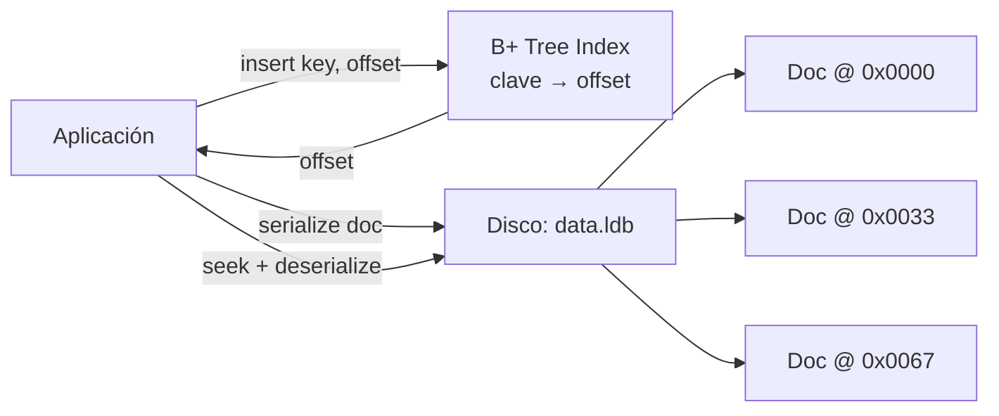
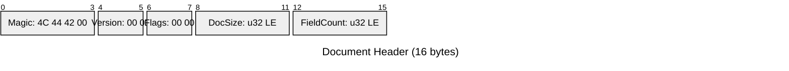
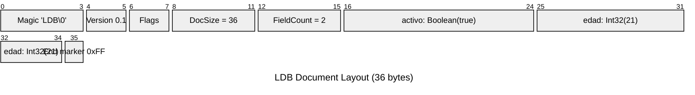
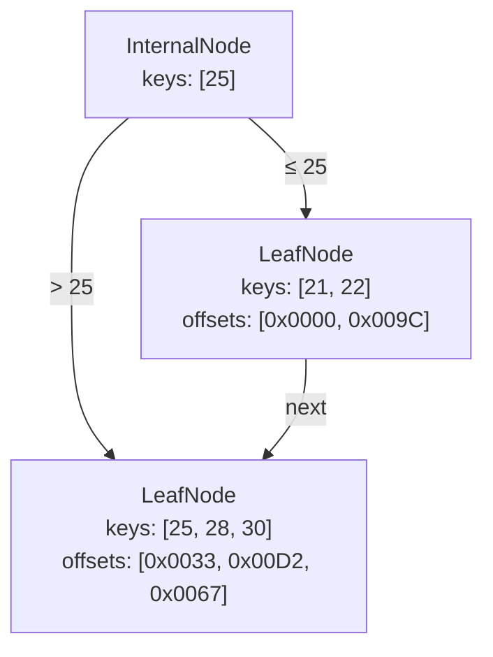

# LDB — LSLS Document Binary Engine

[](https://www.rust-lang.org)
[](#testing)

LDB es un **motor de base de datos documental embebido** escrito en Rust. Está diseñado como prueba de concepto y referencia arquitectónica para un sistema de almacenamiento documental con:

- Un **formato binario propio** (estilo BSON) llamado **LDB**.
- Un **Árbol B+ (B+ Tree)** en memoria para indexar campos y apuntar a offsets en disco.
- **Persistencia del índice** a `index.ldb` para recuperación rápida.
- Recuperación de documentos mediante `seek` directo al archivo de datos.

> **Estado**: implementación de referencia funcional. No es un motor de producción, pero sirve como base sólida para extender hacia WAL, transacciones, concurrencia y persistencia de índices.

---

## Tabla de contenidos

1. [Arquitectura general](#arquitectura-general)
2. [Por qué Rust](#por-qué-rust)
3. [Formato binario LDB](#formato-binario-ldb)
4. [Sistema de indexación B+ Tree](#sistema-de-indexación-b-tree)
5. [Persistencia del índice](#persistencia-del-índice)
6. [Decisiones de diseño](#decisiones-de-diseño)
7. [Estructura del proyecto](#estructura-del-proyecto)
8. [Cómo compilar y probar](#cómo-compilar-y-probar)
9. [Uso básico](#uso-básico)
10. [Ejemplo end-to-end](#ejemplo-end-to-end)
11. [Roadmap](#roadmap)

---

## Arquitectura general



Flujo de una consulta:

1. La aplicación serializa el documento y lo escribe en `data.ldb` (append-only).
2. Se obtiene el `offset` del documento recién escrito.
3. Se inserta `(clave, offset)` en el B+ Tree residente en memoria.
4. Al consultar, el B+ Tree devuelve el offset; se hace `seek` y se deserializa el documento.

---

## Por qué Rust

Se eligió **Rust** sobre C++ por las siguientes razones:

| Criterio | Rust | C++ |
|----------|------|-----|
| **Seguridad de memoria** | Garantizada en tiempo de compilación (borrow checker) | Requiere disciplina manual; riesgo de corrupción de datos |
| **Sin GC** | Adecuado para motores de BD con requisitos de latencia predecible | También sin GC, pero más propenso a errores |
| **Manejo de bytes binarios** | `&[u8]`, `Vec<u8>` y `copy_from_slice` sin costo extra | Posible, pero más verboso y riesgoso |
| **Tipos algebraicos** | `enum` con datos embebidos modela type tags de forma natural | Requiere unions o polimorfismo manual |
| **Ecosistema** | `serde`, `bytes`, `bytemuck` para serialización eficiente | Ecosistema más fragmentado |

En un motor de almacenamiento, un solo *use-after-free* o *buffer overflow* puede corromper datos persistentes. Rust elimina esta clase de errores sin sacrificar rendimiento.

---

## Formato binario LDB

La especificación completa está en [`docs/SERIALIZATION_SPEC.md`](docs/SERIALIZATION_SPEC.md).

### Cabecera del documento (16 bytes)



| Offset | Tamaño | Campo | Descripción |
|--------|--------|-------|-------------|
| 0 | 4 | Magic | `4C 44 42 00` (`"LDB\0"`) |
| 4 | 2 | Version | Mayor (1B) + Menor (1B) |
| 6 | 2 | Flags | Reservado para compresión/checksum |
| 8 | 4 | DocSize | Tamaño total del documento en bytes |
| 12 | 4 | FieldCount | Número de campos de primer nivel |

### Type tags

| Tag | Tipo | Bytes de valor |
|-----|------|----------------|
| `0x01` | Int32 | 4 |
| `0x02` | Int64 | 8 |
| `0x03` | Float64 | 8 |
| `0x04` | String | 4 (longitud) + N |
| `0x05` | Boolean | 1 |
| `0x06` | Sub-document | 4 (longitud) + N |
| `0x07` | Null | 0 |
| `0xFF` | End-of-Document | 0 |

### Ejemplo: `{"edad": 21, "activo": true}`



Hex dump completo (36 bytes):

```
4C 44 42 00  00 01 00 00  24 00 00 00  02 00 00 00
05 06 61 63  74 69 76 6F  01 01 04 65  64 61 64 15
00 00 00 FF
```

> Nota: el orden de campos depende de `BTreeMap`, por lo que `"activo"` (que empieza con 'a') precede a `"edad"` (que empieza con 'e').

---

## Sistema de indexación B+ Tree

La especificación completa está en [`docs/INDEXING_SPEC.md`](docs/INDEXING_SPEC.md).



### Estructura de nodos

```rust
enum Node {
    Internal { keys: Vec<LdbValue>, children: Vec<NodeId> },
    Leaf     { keys: Vec<LdbValue>, offsets: Vec<u64>, next: Option<NodeId> },
}
```

### Operaciones soportadas

- `insert(key, offset)` — inserción con split y propagación hacia arriba.
- `search(key)` — búsqueda exacta.
- `range_greater_than(x)` — todos los offsets con clave > x.
- `range_less_than(x)` — todos los offsets con clave < x.
- `range_between(x, y)` — todos los offsets con x < clave < y.

### Manejo de offsets

Los valores almacenados en las hojas son **offsets absolutos en bytes** dentro del archivo de datos. Para recuperar un documento:

```rust
file.seek(SeekFrom::Start(offset))?;
file.read_exact(&mut header)?;
let doc_size = parse_u32_le(&header[8..12]);
file.read_exact(&mut buf)?;
let doc = deserialize(&buf)?;
```

---

## Persistencia del índice

LDB puede guardar y cargar el B+ Tree desde `index.ldb`:

```rust
use ldb::btree::BPlusTree;
use ldb::index_persistence::{save_index, load_index};
use ldb::spec::LdbValue;

let mut tree = BPlusTree::new(64);
tree.insert(LdbValue::Int32(25), 0x0033);

// Guardar a disco
save_index(&tree, "index.ldb").unwrap();

// Cargar desde disco
let loaded = load_index("index.ldb").unwrap();
assert_eq!(loaded.search(&LdbValue::Int32(25)), Some(0x0033));
```

### Formato de `index.ldb`

La especificación completa está en [`docs/INDEX_PERSISTENCE_SPEC.md`](docs/INDEX_PERSISTENCE_SPEC.md).

- **Cabecera de 32 bytes**: magic `"IDX\0"`, versión, flags, NodeCount, RootNodeId, Order y checksum CRC64.
- **Nodos internos**: `[0x01][NodeSize][KeyCount][keys...][children...]`.
- **Nodos hoja**: `[0x02][NodeSize][KeyCount][keys...][offsets...][next leaf]`.
- Los `NodeId` se almacenan como `u32` en disco y se reconstruyen como `usize` en memoria.
- Los nodos se escriben secuencialmente, por lo que no se requiere tabla de mapeo.

---

## Decisiones de diseño

### 1. Endianness: Little-Endian

Es el endianness nativo de x86_64 y ARM64, lo que evita conversiones en la mayoría de plataformas modernas. Coincide con BSON y con la convención de sistemas de archivos modernos.

### 2. Sin padding

El formato es *packed*. Esto maximiza la densidad de almacenamiento y simplifica el parser, a costa de que el acceso a campos multibyte requiere `copy_from_slice` en lugar de punteros directos.

### 3. Claves con prefijo de longitud de 1 byte

Las claves de campo usan un byte para su longitud (máximo 255 bytes). Esto es suficiente para nombres de campo reales y permite claves con bytes nulos internos, a diferencia de BSON que usa strings terminadas en `\0`.

### 4. Sub-documentos compactos

Los sub-documentos no repiten la cabecera de 16 bytes; solo almacenan `body + 0xFF`. Esto reduce el overhead del anidamiento, que es común en documentos JSON.

### 5. Arena de nodos para el B+ Tree

Se usa `Vec<Node>` con `NodeId = usize` en lugar de `Box<Node>`. Esto facilita:

- Mutaciones compartidas durante splits y merges.
- **Persistencia secuencial del índice a disco.**
- Menor presión sobre el allocator para árboles grandes.

### 6. Comparación total personalizada para `LdbValue`

Rust no permite derivar `Ord` sobre `f64` porque `NaN != NaN`. Se implementó `cmp_ldb_value` que:

- Ordena primero por tipo (discriminante).
- Maneja `NaN` de forma determinista ordenando por bits.
- Permite indexar enteros, floats, strings y booleanos de forma uniforme.

### 7. Política de duplicados: reemplazo de offset

En la fase actual, insertar una clave duplicada reemplaza el offset existente. Esto simplifica el árbol. Para producción se recomienda implementar *posting lists* o permitir entradas duplicadas en hoja.

### 8. `NodeId` como `u32` en disco

`usize` es dependiente de plataforma (4 u 8 bytes). Usar `u32` en `index.ldb` garantiza portabilidad del archivo entre x86 y x64, y 4.294.967.295 nodos es suficiente para un índice embebido.

---

## Estructura del proyecto

```
lsls/
├── Cargo.toml
├── README.md
├── docs/
│   ├── INDEX_PERSISTENCE_SPEC.md  # Especificación de persistencia del índice
│   ├── INDEXING_SPEC.md           # Especificación del B+ Tree
│   └── SERIALIZATION_SPEC.md      # Especificación del formato binario
├── src/
│   ├── lib.rs                     # Módulos públicos
│   ├── btree.rs                   # Implementación del B+ Tree
│   ├── index_persistence.rs       # Persistencia del índice a index.ldb
│   └── spec.rs                    # Serialize/deserialize LDB
├── tests/
│   ├── btree_test.rs              # Tests de inserción y rangos
│   ├── index_persistence_test.rs  # Tests de guardado/carga del índice
│   └── spec_test.rs               # Tests byte-exact y roundtrip
└── examples/
    └── end_to_end.rs              # Demo completa: disco + índice + consultas
```

---

## Cómo compilar y probar

### Requisitos

- [Rust](https://www.rust-lang.org/tools/install) 1.70 o superior.
- Cargo (incluido con Rust).

### Compilar

```bash
cargo build
```

### Ejecutar tests

```bash
# Modo debug
cargo test

# Modo release (recomendado para validar optimizaciones)
cargo test --release
```

### Ejecutar el ejemplo end-to-end

```bash
cargo run --example end_to_end
```

Salida esperada:

```
Escritos 5 documentos en data.ldb
  Doc[0] @ offset 0x0000
  Doc[1] @ offset 0x0033
  ...

Búsqueda exacta edad=25:
  Encontrado @ 0x0033: Some(String("Luis"))

Búsqueda por rango edad > 23:
  @ 0x0033: String("Luis") tiene Int32(25) años
  ...

Guardando índice en index.ldb...
  Índice guardado.

Cargando índice desde index.ldb...
  Índice cargado: orden 4
  Búsqueda con índice cargado edad=25: Some(51)

✅ End-to-end completado exitosamente.
```

---

## Uso básico

### Serializar y deserializar un documento

```rust
use ldb::spec::{serialize, deserialize, Document, LdbValue};

let mut doc = Document::new();
doc.insert("edad", LdbValue::Int32(21));
doc.insert("activo", LdbValue::Boolean(true));

let bytes = serialize(&doc);
let recovered = deserialize(&bytes).unwrap();
assert_eq!(doc, recovered);
```

### Construir un índice y consultar

```rust
use ldb::btree::BPlusTree;
use ldb::spec::LdbValue;

let mut tree = BPlusTree::new(64);
tree.insert(LdbValue::Int32(21), 0x0000);
tree.insert(LdbValue::Int32(25), 0x0033);

assert_eq!(tree.search(&LdbValue::Int32(25)), Some(0x0033));
assert_eq!(tree.range_between(&LdbValue::Int32(20), &LdbValue::Int32(30)),
           vec![0x0000, 0x0033]);
```

### Persistir el índice

```rust
use ldb::btree::BPlusTree;
use ldb::index_persistence::{save_index, load_index};
use ldb::spec::LdbValue;

let mut tree = BPlusTree::new(64);
tree.insert(LdbValue::Int32(25), 0x0033);

save_index(&tree, "index.ldb").unwrap();
let loaded = load_index("index.ldb").unwrap();

assert_eq!(loaded.search(&LdbValue::Int32(25)), Some(0x0033));
```

---

## Ejemplo end-to-end

El ejemplo en [`examples/end_to_end.rs`](examples/end_to_end.rs) demuestra el flujo completo:

1. Crea documentos con campos `nombre`, `edad` y `activo`.
2. Los serializa y escribe de forma append-only en `data.ldb`.
3. Construye un B+ Tree indexando `edad → offset`.
4. Ejecuta búsqueda exacta, rangos `>` y `between`.
5. **Guarda el índice a `index.ldb` y lo recarga**, verificando que sigue funcionando.
6. Recupera documentos desde disco usando los offsets.
7. Verifica integridad con `assert_eq!`.

```bash
cargo run --example end_to_end
```

---

## Roadmap

- [x] **Persistencia del índice** a disco para recuperación rápida.
- [ ] **WAL (Write-Ahead Log)** para durabilidad.
- [ ] **Delete y merge/redistribución** en el B+ Tree.
- [ ] **Posting lists** para soportar múltiples documentos con la misma clave.
- [ ] **Índices compuestos y únicos**.
- [ ] **Concurrencia**: lectores sin bloqueo y escritores con latch.
- [ ] **Compresión de página** y checksums por bloque.

---

## Licencia

Este proyecto es una implementación de referencia educativa. Puedes usarlo y modificarlo libremente.